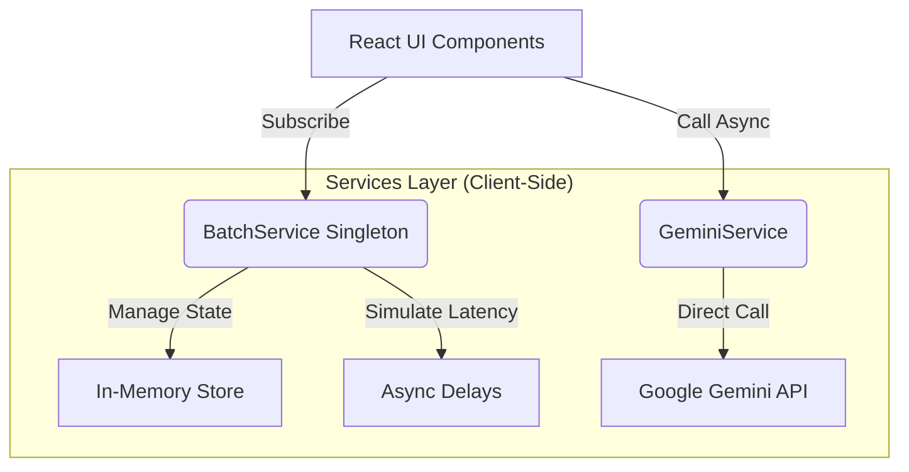

# 📘 Kargo Kopilot: The Complete Guide

**Version:** 1.0.0  
**Status:** ✅ Production-Ready Frontend / 🚧 Mocked Backend Services  
**Tech Stack:** React 18, TypeScript, Tailwind CSS, Google GenAI SDK, Shopify Polaris UX

---

## 1. 🏗️ Architecture Overview

Kargo Kopilot is designed as a **Shopify Embedded App**. This means it runs inside an iframe within the Shopify Admin, leveraging Shopify's session tokens for auth (simulated here) and Polaris for UI consistency.

### The "Simulated Backend" Pattern
To allow rapid frontend development without spinning up a full server immediately, this project uses a **Service-based Architecture** where TypeScript services act as the backend.



### Directory Structure
```
src/
├── components/    # UI building blocks (Cards, Buttons, ProgressBars)
├── pages/         # Route-level views (Orders, Batch, Classify)
├── services/      # The "Brain" (Gemini API, Batch Queue Logic)
├── types/         # Shared TypeScript interfaces
└── App.tsx        # Routing and Layout composition
```

---

## 2. 🧠 Critical Concepts

### The Batch Service (Observer Pattern)
The most complex part of the app is `services/batchService.ts`. It solves the problem of sharing state between the **Orders Page** (creator) and the **Batch Page** (viewer) without using Redux or Context API complexity.

**How it works:**
1.  **Singleton State:** `let batchJobs: BatchJob[] = []` exists outside of React.
2.  **Subscription:** Components call `subscribeToBatches(callback)`.
3.  **Notification:** When the service updates data, it iterates through `listeners` and calls them.
4.  **React Sync:** The `useEffect` in `Batch.tsx` syncs this external state to local React state.

**Why this matters:** If you navigate away from the Batch page, the "processing" continues in the background because the service module remains loaded in memory.

### Dual-AI Classification
We use a hybrid approach for accuracy:
1.  **Gemini Vision:** Analyzes images to determine the *physical* nature of the product.
2.  **Text Analysis:** Analyzes title/description for specific technical specs.
3.  **Result:** The current implementation prioritizes the combined input sent to Gemini 2.5 Flash.

---

## 3. 💻 Implementation Details

### A. The Batch Processing Loop
*Located in: `services/batchService.ts`*

This mimics a server-side queue worker.

```typescript
// 1. Create Job
const newJob = { status: 'queued', ... };

// 2. Trigger Async Processor (Fire and Forget)
processBatch(id, orders); 

// 3. The Processor Loop
const processBatch = async (jobId, orders) => {
  updateJob({ status: 'processing' });
  
  for (const order of orders) {
    // SIMULATED LATENCY
    await new Promise(r => setTimeout(r, randomDelay));
    
    // LOGIC & UPDATE
    const result = ...; 
    updateJob({ processed: +1, results: [...results, result] });
  }
  
  updateJob({ status: 'completed' });
}
```

### B. The Progress Bar Component
*Located in: `components/ui/ProgressBar.tsx`*

A purely presentational component that handles the CSS transition for smooth filling.
*   **Tip:** Always clamp values: `Math.min(100, Math.max(0, progress))`.

---

## 4. ⚠️ Common Pitfalls & Solutions

### 1. The "Stale Closure" in Subscriptions
**Symptom:** The Batch page doesn't update, or updates with old data.
**Cause:** React `useEffect` not cleaning up the listener.
**Solution:**
```typescript
// Correct Usage in React Component
useEffect(() => {
  // subscribe returns a cleanup function
  const unsubscribe = subscribeToBatches((data) => setJobs(data));
  return () => unsubscribe(); // CRITICAL
}, []);
```

### 2. Gemini API Rate Limits
**Symptom:** 429 Errors during batch processing.
**Fix:** The simulated service includes a random delay. In production, you MUST implement an exponential backoff strategy.
```typescript
// Production Pseudocode
const delay = (retryCount) => Math.pow(2, retryCount) * 1000;
```

### 3. Image Payload Size
**Symptom:** "Payload Too Large" error from Gemini.
**Solution:** The `classifyProductWithGemini` service strips the Data URL prefix (`data:image/jpeg;base64,`) before sending to the API. The API expects raw Base64.

---

## 5. 🚀 Deployment Strategy (Production Transfer)

To move this from "Demo" to "Production":

1.  **Move API Keys:** currently, `process.env.API_KEY` is used in the client. **This is unsafe.** Move `geminiService.ts` logic to a Next.js API Route (`/api/classify`).
2.  **Persist Batch State:** Replace the `let batchJobs` array in `batchService.ts` with Supabase database calls.
3.  **Real Queue:** Use Redis (via BullMQ or similar) instead of the `for...of` loop in `processBatch`.

---

## 6. 🛡️ Security Checklist

- [ ] **API Key Rotation:** Ensure Gemini keys are rotated if exposed.
- [ ] **Input Sanitization:** Sanitize `description` inputs before sending to AI to prevent Prompt Injection.
- [ ] **Access Control:** Ensure only authenticated Shopify users can trigger `createBatchJob`.

---

## 7. 🔧 Troubleshooting Guide

| Error | Likely Cause | Fix |
|-------|--------------|-----|
| `No response from Gemini` | API Key Invalid or Quota Exceeded | Check `.env` and Google AI Studio quota. |
| Batch page is empty | Service memory reset | Data is in-memory only. Refreshing the page clears the mock DB. |
| Styling looks broken | Tailwind missing | Ensure `cdn.tailwindcss.com` script is in `index.html`. |
